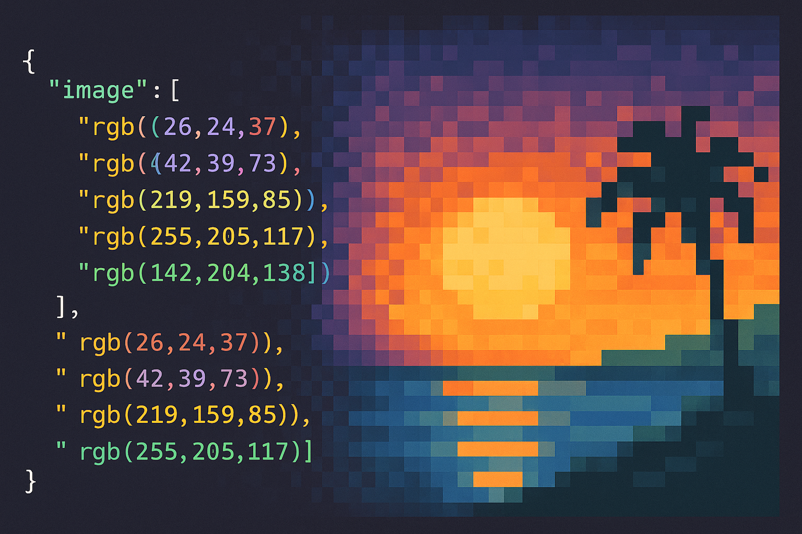
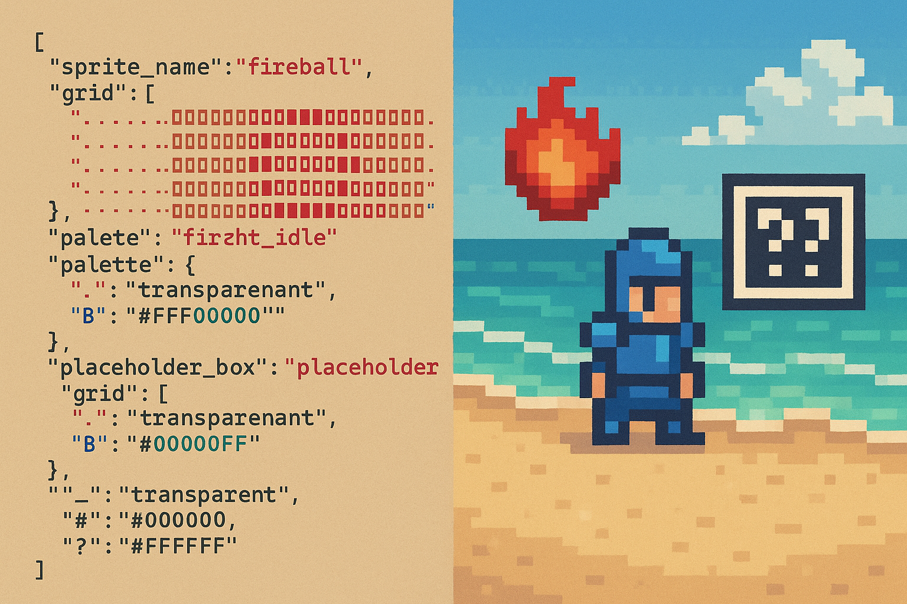

# json2sprite

[](https://github.com/soulwax/json2sprite/actions/workflows/ci.yml)
[](https://codecov.io/gh/soulwax/json2sprite)
[](https://badge.fury.io/py/json2sprite)
[](https://pypi.org/project/json2sprite/)
[](https://www.gnu.org/licenses/agpl-3.0)
[](https://www.python.org/)
[](https://black.readthedocs.io/en/stable/)
[](https://noaimovement.com/)

A soon to be very robust Python utility that converts JSON sprite descriptions into PNG images and horizontal spritesheets. I don't know yet of any other tool that does this especially not if this goes web based, but I also cannot yet think of a real use case for this for myself personally except for liking the idea.

ANY kind of feedback as well as contributions are welcome with zero expectations on my side as well as zero bureaucracy or code of conducts or any of this bs for such a small project. Just bee urself lmao.

## __STRICT NO AI RULE__ for the code! Only exceptions I can think of are the most tedious of tasks like formatting and linting, markdown summaries and the like, that goes without saying.



<!--  -->

## Features

- ✨ __JSON to PNG__: Render individual sprites defined as a grid and palette in JSON into PNG images
- 🔄 __PNG to JSON__: Reverse conversion - extract sprite data from PNG images back to JSON format
- 🖼️ __Spritesheets__: Combine multiple sprites into horizontal spritesheets or split them back into individual sprites
- 🎨 __Transparency__: Full support for transparent pixels
- 🧪 __Fully tested__: Comprehensive test suite with pytest (100% coverage goal)
- 🔍 __Type safe__: Complete type hints and error handling
- 📦 __Easy install__: Available via pip
- 🔧 __Flexible__: Command-line interface and Python API

## Installation

### From PyPI (when published)

```bash
pip install json2sprite
```

### From source

```bash
git clone https://github.com/soulwax/json2sprite.git
cd json2sprite
pip install -e ".[dev]"
```

## Quick Start

### Command Line Usage

Process a single JSON file:

```bash
json2sprite input/example1.json
```

Process an entire folder (maintains directory structure):

```bash
json2sprite input/
```

### Python API Usage

```python
from json2sprite import render_sprite, make_spritesheet
from PIL import Image

# Define a sprite
sprite_data = {
    "grid": [
        "..R..",
        ".RRR.",
        "RRRRR"
    ],
    "palette": {
        ".": "transparent",
        "R": "#FF0000"
    }
}

# Render single sprite
img = render_sprite(sprite_data, pixel_size=16)
img.save("output.png")

# Create spritesheet from multiple sprites
sprites = [sprite_data, sprite_data, sprite_data]
sheet = make_spritesheet(sprites, pixel_size=16, padding=4)
sheet.save("spritesheet.png")
```

## JSON Format

### Single Sprite Object

```json
{
  "grid": [
    "..R..",
    ".RRR.",
    "RRRRR"
  ],
  "palette": {
    ".": "transparent",
    "R": "#FF0000"
  }
}
```

### Multiple Sprites (Spritesheet)

```json
[
  {
    "sprite_name": "fireball",
    "grid": ["..R..", ".RRR."],
    "palette": {".": "transparent", "R": "#FF3C00"}
  },
  {
    "sprite_name": "knight",
    "grid": ["..B..", ".BBB."],
    "palette": {".": "transparent", "B": "#2C5FFF"}
  }
]
```

## Output

By default, PNG files are written to the `output/` directory:

- Single-file input produces `output/<name>.png`
- Folder input preserves relative paths and replaces `.json` with `.png`

## Development

### Setup Development Environment

```bash
# Clone the repository
git clone https://github.com/soulwax/json2sprite.git
cd json2sprite

# Create virtual environment
python -m venv .venv

# Activate virtual environment
# On Windows:
.\.venv\Scripts\Activate.ps1
# On Linux/Mac:
source .venv/bin/activate

# Install in development mode with all dependencies
pip install -e ".[dev]"
```

### Running Tests

```bash
# Run all tests
pytest

# Run with coverage report
pytest --cov=json2sprite --cov-report=html

# Run specific test file
pytest tests/test_core.py

# Run with verbose output
pytest -v
```

### Code Quality Checks

```bash
# Format code with Black
black src/ tests/

# Check code style
black --check src/ tests/

# Lint with Pylint
pylint src/json2sprite/

# Type check with mypy
mypy src/json2sprite/
```

### Building the Package

```bash
# Install build tools
pip install build twine

# Build distribution packages
python -m build

# Check the package
twine check dist/*

# Upload to TestPyPI
twine upload --repository testpypi dist/*

# Upload to PyPI
twine upload dist/*
```

## Project Structure

```bash
json2sprite/
├── .github/
│   └── workflows/
│       └── ci.yml          # GitHub Actions CI/CD
├── src/
│   └── json2sprite/
│       ├── __init__.py     # Package initialization
│       ├── core.py         # Core rendering functions
│       ├── processor.py    # File processing utilities
│       └── cli.py          # Command-line interface
├── tests/
│   ├── conftest.py         # Pytest configuration
│   ├── test_core.py        # Core functionality tests
│   ├── test_processor.py   # File processing tests
│   ├── test_cli.py         # CLI tests
│   └── test_init.py        # Package tests
├── input/                  # Example input files
├── output/                 # Generated output files
├── .gitignore
├── LICENSE.md
├── MANIFEST.in
├── README.md
├── pyproject.toml          # Package configuration
└── requirements.txt        # Runtime dependencies
```

## Configuration

The following parameters can be adjusted:

- `pixel_size`: Scale factor for output images (default: 16)
- `padding`: Pixels between sprites in spritesheet (default: 4)

These can be configured in the code or by modifying the function calls in your script.

## Contributing

Contributions are welcome! Please feel free to submit a Pull Request.

1. Fork the repository
2. Create your feature branch (`git checkout -b feature/AmazingFeature`)
3. Run tests (`pytest`)
4. Run code quality checks (`black`, `pylint`, `mypy`)
5. Commit your changes (`git commit -m 'Add some AmazingFeature'`)
6. Push to the branch (`git push origin feature/AmazingFeature`)
7. Open a Pull Request

## License

This project is licensed under the GNU Affero General Public License v3.0 or later (AGPL-3.0-or-later). See [LICENSE.md](LICENSE.md) for details.

## Author

soulwax@github

## Acknowledgments

- Built with [Pillow](https://python-pillow.org/) for image processing
- Tested with [pytest](https://pytest.org/)
- Code formatting with [Black](https://black.readthedocs.io/)
- Linting with [Pylint](https://pylint.org/)
